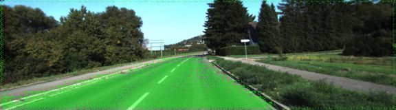

# Semantic Segmentation
### Introduction
This implementation of [Semantic Segmentation](https://github.com/udacity/CarND-Semantic-Segmentation)  is built for Udacity's Self-Driving Car Nonodegree.**

In this project, you'll label the pixels of a road in images using a Fully Convolutional Network (FCN).

### Setup
##### GPU
`main.py` will check to make sure you are using GPU - if you don't have a GPU on your system, you can use AWS or another cloud computing platform.
##### Frameworks and Packages
Make sure you have the following is installed:
 - [Python 3](https://www.python.org/)
 - [TensorFlow](https://www.tensorflow.org/)
 - [NumPy](http://www.numpy.org/)
 - [SciPy](https://www.scipy.org/)

You may also need [Python Image Library (PIL)](https://pillow.readthedocs.io/) for SciPy's `imresize` function.

##### Dataset
Download the [Kitti Road dataset](http://www.cvlibs.net/datasets/kitti/eval_road.php) from [here](http://www.cvlibs.net/download.php?file=data_road.zip).  Extract the dataset in the `data` folder.  This will create the folder `data_road` with all the training a test images.


### Run
Run the following command to run the project:
```
python main.py
```
**Note:** If running this in Jupyter Notebook system messages, such as those regarding test status, may appear in the terminal rather than the notebook.


### Why Layer 3, 4 and 7?
In `main.py`, you'll notice that layers 3, 4 and 7 of VGG16 are utilized in creating skip layers for a fully convolutional network. The reasons for this are contained in the paper [Fully Convolutional Networks for Semantic Segmentation](https://arxiv.org/pdf/1605.06211.pdf).

In section 4.3, and further under header "Skip Architectures for Segmentation" and Figure 3, they note these provided for 8x, 16x and 32x upsampling, respectively. Using each of these in their FCN-8s was the most effective architecture they found. 

### Results
To see the resulting images, download the `runs` folder.

The goal here is to achieve 80% efficiency. In some images, the streets are poorly identified while in others it's mostly correctly identified.

The parts where the model prforms badly are where shadow and discolouration cause pixel Variations.

Sufficient Result          |  Insufficient Result (Discolouration)     |   Insufficient Result( Shadow)
:-------------------------:|:----------------------------------------:|:-----------------------------
  |  |


```python

```
